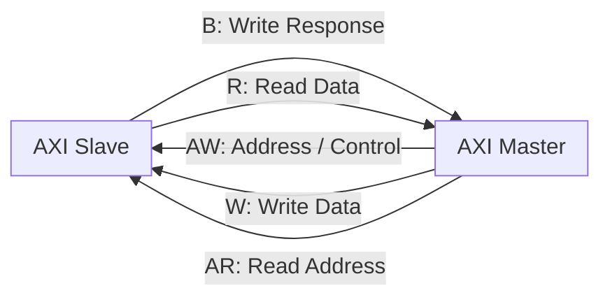
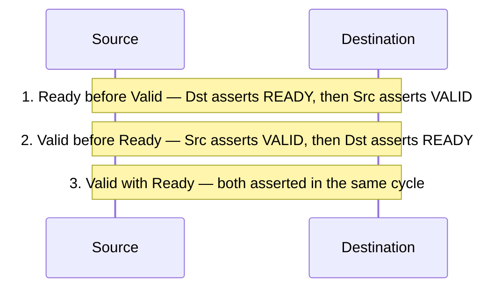
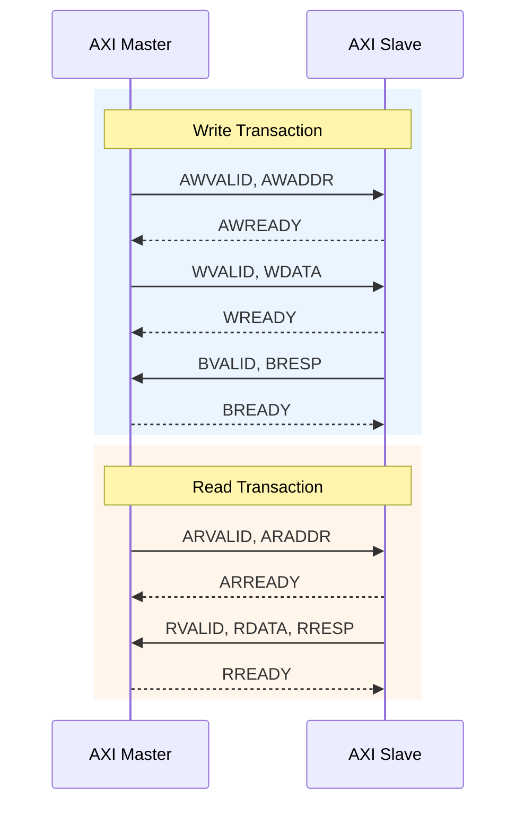
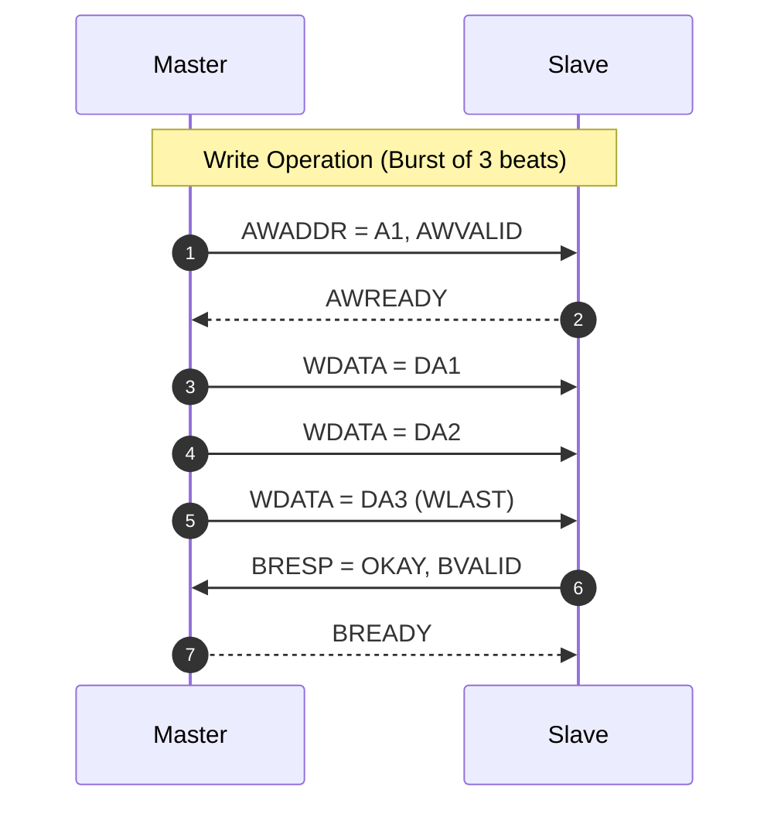
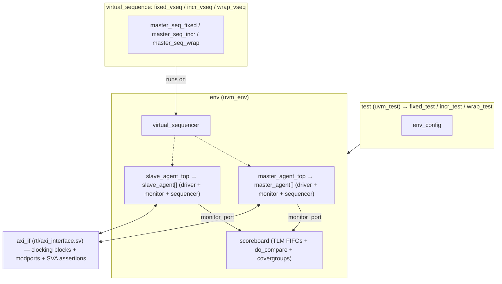

# AXI VIP Verification Project

A **UVM-based Verification IP (VIP)** for the **AMBA AXI (Advanced eXtensible Interface)** protocol. This project implements a reusable, coverage-driven testbench that verifies protocol compliance, data integrity, and response correctness between an AXI Master and AXI Slave interface.


---

## Table of Contents

- [Introduction](#introduction)
- [Features of AXI](#features-of-axi)
- [AXI Channels](#axi-channels)
- [Signals of AXI](#signals-of-axi)
- [AXI Protocol](#axi-protocol)
- [Flow Control](#flow-control)
- [AXI Master–Slave Communication](#axi-masterslave-communication)
- [AXI Bus Transfer](#axi-bus-transfer)
- [AXI VIP Testbench Architecture](#axi-vip-testbench-architecture)
- [Scoreboard](#scoreboard)
- [Objectives & Challenges](#objectives--challenges)
- [Conclusion](#conclusion)
- [Tech Stack](#tech-stack)
- [Repository Structure](#repository-structure)
- [Architecture (as implemented)](#architecture-as-implemented)
- [Transaction (axi_xtn)](#transaction-axi_xtn)
- [axi_if — Interface & Protocol Checking](#axi_if--interface--protocol-checking)
- [Scoreboard & Functional Coverage](#scoreboard--functional-coverage)
- [Test List](#test-list)
- [How to Run](#how-to-run)

---

## Introduction

ARM created a set of on-chip communication protocols known as **AMBA (Advanced Microcontroller Bus Architecture)**, used to facilitate communication between components inside SoC designs. **AXI, AHB, and APB** buses are all part of the AMBA architecture.

AXI buses:
- Provide **full-duplex communication** — read and write at the same time
- Are suitable for **high-bandwidth, low-latency** designs
- Provide **high-frequency operation** without complex bridges
- Meet the interface requirements of a wide range of components
- Are suitable for **memory controllers** with high initial access latency
- Provide flexibility in the implementation of interconnect architectures

## Features of AXI

- Separate address/control and data phases
- Support for unaligned data transfers using byte strobes
- Burst-based transactions — multiple data transfers per single issued start address
- Separate read and write data channels — enables low-cost DMA
- Support for issuing multiple outstanding addresses
- Support for out-of-order transaction completion
- Easy addition of register stages for timing closure

## AXI Channels

AXI uses **5 independent channels** to perform read and write operations:

| Channel | Full Name | Direction |
|---|---|---|
| AW | Write Address Channel | Master → Slave |
| W  | Write Data Channel | Master → Slave |
| B  | Write Response Channel | Slave → Master |
| AR | Read Address Channel | Master → Slave |
| R  | Read Data Channel | Slave → Master |

A **burst** is a series of multiple data transfers ("beats") grouped together and initiated by a single address on a channel. Each burst carries a unique **ID** — IDs match across AW/W/B (write) and across AR/R (read), but write and read IDs are independent of each other.



## Signals of AXI

### Write Address Channel Signals

| Signal | Source | Description |
|---|---|---|
| AWID[3:0] | M | Write address ID |
| AWADDR[31:0] | M | Write address — first address in a write burst |
| AWLEN[3:0] | M | Burst length — 1 to 16 transfers in a burst |
| AWSIZE[2:0] | M | Burst size — 1, 2, 4 … 64, 128 bytes per transfer |
| AWBURST[1:0] | M | Burst type — Fixed, Incrementing, Wrapping |
| AWVALID | M | Write address/control valid |
| AWREADY | S | Write address/control accepted |

### Write Data Channel Signals

| Signal | Source | Description |
|---|---|---|
| WID[3:0] | M | Write data ID — must match AWID |
| WDATA[31:0] | M | Write data — can be 8, 16, 32 … 512, 1024 bits wide |
| WSTRB[3:0] | M | Write strobes — one strobe bit per byte lane |
| WLAST | M | Indicates the last transfer in a burst |
| WVALID | M | Write data valid |
| WREADY | S | Write data accepted |

### Write Response Channel Signals

| Signal | Source | Description |
|---|---|---|
| BID[3:0] | S | Write response ID — must match AWID |
| BRESP[1:0] | S | Write response (status) |
| BVALID | S | Write response valid |
| BREADY | M | Write response accepted |

### Read Address Channel Signals

| Signal | Source | Description |
|---|---|---|
| ARID[3:0] | M | Read address ID |
| ARADDR[31:0] | M | Read address — first address in a read burst |
| ARLEN[3:0] | M | Burst length — 1 to 16 transfers in a burst |
| ARSIZE[2:0] | M | Burst size — 1, 2, 4 … 64, 128 bytes per transfer |
| ARBURST[1:0] | M | Burst type — Fixed, Incrementing, Wrapping |
| ARVALID | M | Read address/control valid |
| ARREADY | S | Read address/control accepted |

### Read Data Channel Signals

| Signal | Source | Description |
|---|---|---|
| RID[3:0] | S | Read data ID — must match ARID |
| RDATA[31:0] | S | Read data — can be 8, 16, 32 … 512, 1024 bits wide |
| RRESP[1:0] | S | Read response (status) |
| RLAST | S | Indicates the last transfer in a burst |
| RVALID | S | Read data valid |
| RREADY | M | Read data accepted |

*(M = driven by Master, S = driven by Slave)*

## AXI Protocol

- The **first address** is sent by the master; the **slave calculates the remaining addresses** in the burst.
- Master and slave communicate using **VALID/READY handshaking** on all 5 channels.
- When the master initiates an operation, it sends control information (VALID signal + address) on the address channel.
- Three burst types are supported: **FIXED**, **INCR** (supports unaligned transfers), and **WRAP**.
- The `xLEN[2:0]` signal determines the total number of transfers in a burst:

```
  Number of transfers = xLEN + 1
```

## Flow Control

Information moves on the bus only when **both** of the following are true in the same clock cycle:
- **Source is VALID**, and
- **Destination is READY**

Three valid handshake timing relationships are supported by AXI:



The transfer completes on the clock edge where VALID and READY are **both high**, regardless of which signal asserted first.

## AXI Master–Slave Communication

### Write Transaction

1. Master Driver sends **Write Address** (AWVALID, AWADDR) and **Write Data** (WVALID, WDATA) on the bus.
2. Slave Driver asserts **AWREADY** and **WREADY** when ready.
3. When VALID and READY are high in the same cycle, the address/data transfer happens.
4. After a successful data transfer, the Slave Driver sends a **Write Response** (BVALID, BRESP).
5. Master Driver asserts **BREADY** to acknowledge.

### Read Transaction

1. Master Driver sends **Read Address** (ARVALID, ARADDR).
2. Slave Driver asserts **ARREADY** to accept it.
3. Slave Driver sends **Read Data** (RVALID, RDATA, RRESP).
4. Master Driver asserts **RREADY** to acknowledge data reception.



### Additional Rules

- All transactions are observed by both the **Master Monitor** and **Slave Monitor**, which forward data to the **Scoreboard** for checking and coverage tracking.
- The handshake mechanism is **identical across all 5 channels**.
- Read/write transfer ordering must be respected:
  - The master must wait for **BRESP** of the first write transaction before starting a read transaction.
  - The master must wait for **RLAST** before starting the next write transaction.

## AXI Bus Transfer

**Write Operation** — AWVALID/AWADDR is issued once; WDATA beats (DA1, DA2, DA3) are streamed with WVALID/WREADY handshaking, terminated by WLAST, followed by a BRESP/BVALID/BREADY response.

**Read Operation** — ARVALID/ARADDR is issued (potentially for multiple outstanding addresses A, B); RDATA beats stream back with RVALID/RREADY handshaking, with RLAST marking the end of each burst.



## AXI VIP Testbench Architecture

The UVM testbench is built around independent **Master** and **Slave** agents, connected through a central **Scoreboard**, with a **Coverage Model** collecting functional coverage from both sides.


**Key components:**

| Component | Role |
|---|---|
| Master Sequencer | Generates randomized/directed write & read address and data sequences |
| Master Driver | Drives AW/W/B/AR/R signals onto the bus per the sequence items |
| Master Monitor | Passively observes bus activity and reconstructs transactions |
| Slave Sequencer / Driver | Generates and drives slave-side responses (READY signals, response codes) |
| Slave Monitor | Passively observes slave-side bus activity |
| Scoreboard | Compares master-side and slave-side transactions for correctness |
| Coverage Model | Tracks functional coverage of protocol scenarios (burst types, sizes, IDs, etc.) |
| Master/Slave Agent Config | Configures each agent as **Active** (drives + monitors) |

## Scoreboard

- Performs all **comparisons** and **functional coverage** collection.
- Compares data arriving from the **master side** against data arriving from the **slave side**.
- Comparison checks corresponding **IDs, addresses, and data** for both read and write operations.
- Functional coverage is captured via **covergroups** for both write and read operations.

## Conclusion

This verification environment is designed to:
- Generate, drive, and monitor **AXI read/write transactions** across all five channels (AW, W, B, AR, R)
- Validate **protocol compliance**, **data integrity**, and **response correctness** between the Master and Slave interfaces

Extensive simulation results confirm that:
- The **AXI handshaking (VALID–READY)** mechanism is correctly implemented
- All AXI transactions meet the expected specifications
- No data mismatches or protocol violations were detected during verification cycles

**This project provides:**
- A reusable and configurable **AXI Verification IP** that can be easily integrated into larger SoC-level environments
- A solid foundation for verifying any AXI-based design, and strengthens understanding of **UVM-based constrained-random verification**, **coverage-driven testing**, and **assertion-based validation**

---

## Tech Stack

- **HDL/Verification Language:** SystemVerilog
- **Methodology:** UVM (Universal Verification Methodology)
- **Protocol:** AMBA AXI3 (16-beat max burst length, `AWID`/`ARID`-based ordering)
- **Simulators supported by the Makefile:** Mentor **Questa** (default) and Synopsys **VCS** (with Verdi/FSDB waveform dumping)

## Repository Structure

This matches the actual layout of the repo:

```
AXI-VIP-Verification/
├── rtl/
│   └── axi_interface.sv        # axi_if: signals, clocking blocks, modports, SVA protocol assertions
├── master_top/
│   ├── master_config.sv        # master_config: virtual interface handle + active/passive
│   ├── master_xtn.sv           # axi_xtn: randomizable transaction (address calc, WSTRB calc, do_compare/do_print)
│   ├── master_sequence.sv      # master_base_sequence, master_seq_fixed/incr/wrap
│   ├── master_sequencer.sv     # master_sequencer (uvm_sequencer #(axi_xtn))
│   ├── master_driver.sv        # master_driver: drives AW/W/B and AR/R channels
│   ├── master_monitor.sv       # master_monitor: passively samples the bus, publishes via analysis port
│   ├── master_agent.sv         # master_agent: wires up driver + monitor + sequencer
│   └── master_agent_top.sv     # master_agent_top: instantiates N master agents
├── slave_top/
│   ├── slave_config.sv
│   ├── slave_sequencer.sv
│   ├── slave_driver.sv         # slave_driver: drives responses (READY, BRESP/RRESP, RDATA)
│   ├── slave_monitor.sv
│   ├── slave_agent.sv
│   └── slave_agent_top.sv
├── tb/
│   ├── env_config.sv           # env_config: agent counts, has_scoreboard, has_virtual_sequencer, etc.
│   ├── virtual_sequencer.sv    # virtual_sequencer: holds handles to all master/slave sequencers
│   ├── virtual_sequence.sv     # vbase_seq, fixed_vseq, incr_vseq, wrap_vseq
│   ├── scoreboard.sv           # scoreboard: TLM FIFOs, do_compare-based checking, functional covergroups
│   ├── axi_env.sv              # env: builds agents, scoreboard, virtual sequencer; connects monitors → scoreboard
│   └── top.sv                  # top-level module: clock/reset gen, axi_if instance, run_test()
├── test/
│   ├── axi_package.sv          # axi_pkg: includes every file above, in compile order
│   └── axi_test.sv             # test (base), fixed_test, incr_test, wrap_test
├── sim/
│   └── Makefile                # Questa / VCS compile + run + coverage targets
├── images/                      # (diagrams / waveform screenshots — see repo)
└── README.md
```

> **Note:** files in the repository currently have a `.txt` extension (e.g. `master_driver.txt`) rather than `.sv`. They contain valid SystemVerilog/UVM source — likely uploaded as `.txt` to avoid GitHub's syntax-highlighting/binary handling for unfamiliar extensions, or simply a naming oversight. Rename them to `.sv` before compiling (the `Makefile` and `axi_package.sv` include directives both expect the `.sv` extension).

## Architecture (as implemented)



**How a test runs:** `top.sv` generates clock/reset, instantiates `axi_if`, and calls `run_test()`. The selected `test` (via `+UVM_TESTNAME`) builds an `env_config`, fetches the virtual interface from `uvm_config_db`, and builds the `env`. Each directed test (`fixed_test`, `incr_test`, `wrap_test`) starts its matching virtual sequence (`fixed_vseq`, `incr_vseq`, `wrap_vseq`) on the `virtual_sequencer`, which in turn starts a `master_seq_fixed` / `master_seq_incr` / `master_seq_wrap` sequence on the master sequencer.

## Transaction (`axi_xtn`)

The `axi_xtn` sequence item (`master_top/master_xtn.sv`) carries **all five channels** in one randomizable object, plus derived fields it computes in `post_randomize()`:

- **Random fields:** `AWADDR/AWID/AWBURST/AWSIZE/AWLEN`, `WID/WDATA[]`, `BID`, `ARID/ARADDR/ARLEN/ARSIZE/ARBURST`, `RID/RDATA[]`
- **Key constraints:**
  - `WDATA.size() == AWLEN+1` and `RDATA.size() == ARLEN+1` — burst length drives payload size
  - `AWID == WID == BID` and `ARID == RID` — write/read ID matching (per spec)
  - `AWBURST`/`ARBURST` weighted across `FIXED (0)` / `INCR (1)` / `WRAP (2)`
  - Address-alignment constraints for `WRAP` bursts (`AWADDR % 2 == 0` for `SIZE=1`, `% 4 == 0` for `SIZE=2`, etc.)
  - `AWLEN`/`ARLEN inside {[0:15]}` — AXI3 burst-length limit (max 16 beats)
- **Computed in `post_randomize()`:**
  - `cal_addr()` / `cal_raddr()` — calculates every beat address for `FIXED`, `INCR`, and `WRAP` burst types (including wrap-boundary rollover)
  - `strb_cal()` — calculates `WSTRB` per beat based on byte-lane alignment
- `do_compare()` — used by the scoreboard to compare a master-side transaction against a slave-side transaction field-by-field
- `do_print()` — pretty-prints every field (hex/dec/bin) for waveform-free debug


## Address Calculation Logic

Each `axi_xtn` only randomizes the **first** address (`AWADDR`/`ARADDR`) — exactly as the real AXI protocol works, where the master issues a single start address and every subsequent beat address is *derived*, not sent on the bus. The transaction computes the address for every beat itself, in `post_randomize()`, via `cal_addr()` (write) / `cal_raddr()` (read) — both use the same algorithm, mirrored for `AW*`/`W*` and `AR*`/`R*` signals respectively.

### Setup (per burst)

```
no_of_bytes    = 2 ^ AWSIZE                              // bytes transferred per beat
aligned_addr   = floor(AWADDR / no_of_bytes) * no_of_bytes   // AWADDR rounded down to a no_of_bytes boundary
start_addr     = AWADDR                                  // the original, unaligned start address
burst_length   = AWLEN + 1                                // total number of beats

wrap_boundary  = floor(AWADDR / (no_of_bytes * burst_length)) * (no_of_bytes * burst_length)   // lower wrap boundary
upper_boundary = wrap_boundary + (no_of_bytes * burst_length)                                  // upper wrap boundary

addr[0] = AWADDR   // beat 0 always uses the exact address that was sent on the bus
```

### Per-beat address, by `AWBURST` type

| `AWBURST` | Type | Address rule (beat `i`, `i ≥ 1`) |
|---|---|---|
| `00` | **FIXED** | `addr[i] = AWADDR` — every beat re-uses the same address (used for streaming into/out of a FIFO-style register) |
| `01` | **INCR** | `addr[i] = aligned_addr + (i × no_of_bytes)` — address increments by the transfer size every beat |
| `10` | **WRAP** | `addr[i] = aligned_addr + (i × no_of_bytes)`, **but** once the running address reaches `upper_boundary`, it rolls back to `wrap_boundary` and continues incrementing from there (`addr[i] = start_addr + (i × no_of_bytes) − (no_of_bytes × burst_length)`) — this keeps the whole burst inside one naturally-aligned address window, which is how AXI supports ring-buffer/cache-line style accesses |

**Worked example — WRAP burst:** `AWADDR = 0x104`, `AWSIZE = 1` (2 bytes/beat), `AWLEN = 3` (4 beats):
- `no_of_bytes = 2`, `aligned_addr = 0x104`, `wrap_boundary = 0x100`, `upper_boundary = 0x108`
- Beats: `0x104 → 0x106 → 0x100 (wraps here) → 0x102`

The read path (`cal_raddr()`) applies the identical logic using `ARADDR`/`ARSIZE`/`ARLEN`/`ARBURST`, storing results for the `RDATA[]` beats.

### `WSTRB` (write strobe) calculation — `strb_cal()`

`WSTRB` marks which byte lanes of the (4-byte-wide) data bus actually carry valid data on each beat — this is what lets AXI support **unaligned / narrow transfers** without wasting bus width.

```
data_bus_bytes = 4   // fixed 32-bit data bus width in this VIP

// Beat 0 (uses the true, possibly-unaligned start_addr):
lower_byte_lane_0 = start_addr − floor(start_addr / data_bus_bytes) × data_bus_bytes
upper_byte_lane_0 = (aligned_addr + no_of_bytes − 1) − floor(start_addr / data_bus_bytes) × data_bus_bytes
→ set WSTRB[0][lower_byte_lane_0 : upper_byte_lane_0] = 1

// Beats 1..AWLEN (uses the calculated addr[i]):
lower_byte_lane = addr[i] − floor(addr[i] / data_bus_bytes) × data_bus_bytes
upper_byte_lane = lower_byte_lane + no_of_bytes − 1
→ set WSTRB[i][lower_byte_lane : upper_byte_lane] = 1
```

**Worked example:** `AWSIZE = 0` (1 byte/beat), `start_addr = 0x105` → `0x105 mod 4 = 1`, so only **byte lane 1** is asserted: `WSTRB[0] = 4'b0010`. This matches the strobe bin patterns the scoreboard's `write_cg1` covergroup checks for (`4'b1111`, `4'b1100`, `4'b0011`, `4'b1000`, `4'b0100`, `4'b0010`, `4'b0001`, `4'b1110`).


## `axi_if` — Interface & Protocol Checking

`rtl/axi_interface.sv` defines the interface with 4 modports (`M_DRV_MP`, `M_MON_MP`, `S_DRV_MP`, `S_MON_MP`) and clocking blocks for the master driver, master monitor, slave driver, and slave monitor respectively. It also embeds **SystemVerilog Assertions (SVA)** that check protocol legality independently of the UVM testbench:

| Assertion | Checks |
|---|---|
| `awvalid` / `wvalid` / `bvalid` / `arvalid` / `rvalid` | Control/data signals stay stable from VALID assertion until the matching READY |
| `awvalid_awready`, `wvalid_wready`, `bvalid_bready`, `arvalid_arready`, `rvalid_rready` | VALID must stay high until READY is seen (no premature de-assertion) |
| `R_wrap_type`, `R_wrap_type_1`, `W_wrap_type`, `W_wrap_type_1` | Address alignment rules for `WRAP` bursts on both read and write |

## Scoreboard & Functional Coverage

`tb/scoreboard.sv`:
- Uses `uvm_tlm_analysis_fifo #(axi_xtn)` per master/slave agent to receive transactions from the monitors.
- Calls `m_xtn.compare(s_xtn)` (built on `axi_xtn::do_compare()`) each cycle; logs `"comparison successful"` or raises a `Master and slave packet Mismatch` UVM error.
- Tracks `pkt_rcvd` / `pkt_cmprd` counters, reported in `report_phase`.
- Four **covergroups**:
  - `write_cg` — cross of `AWBURST × AWSIZE × AWLEN`, plus `AWADDR` and `BRESP` coverpoints
  - `write_cg1` — per-beat cross of `WDATA × WSTRB` (WSTRB bins cover all-lanes, half-lanes, and single-lane strobe patterns)
  - `read_cg` — cross of `ARBURST × ARSIZE × ARLEN`, plus `ARADDR` coverpoint
  - `read_cg1` — per-beat `RDATA`/`RRESP` coverpoints

## Test List

| Test (`+UVM_TESTNAME=`) | Virtual Sequence | Master Sequence | Burst Type |
|---|---|---|---|
| `test` | *(base — no stimulus)* | — | — |
| `fixed_test` | `fixed_vseq` | `master_seq_fixed` (10 randomized xtns, `AWBURST=ARBURST=0`) | FIXED |
| `incr_test` | `incr_vseq` | `master_seq_incr` (100 randomized xtns, `AWBURST=ARBURST=1`) | INCR |
| `wrap_test` | `wrap_vseq` | `master_seq_wrap` (100 randomized xtns, `AWBURST=ARBURST=2`) | WRAP |

## How to Run

The `sim/Makefile` supports both **Questa** and **VCS** (set `SIMULATOR = Questa` or `SIMULATOR = VCS` at the top of the Makefile).

```bash
cd sim

# See all available targets
make help

# Compile only
make sv_cmp

# Clean, compile & run a specific directed test (Questa)
make run_test1     # fixed_test
make run_test2     # incr_test
make run_test3     # wrap_test

# View waveforms (Questa .wlf)
make view_wave2     # opens fixed_test's waveform

# Run the full regression + merge coverage + open HTML report
make regress
make cov
```

For VCS, the equivalent targets are suffixed `_VCS` (e.g. `run_test1_VCS`) and dump `.fsdb` waveforms viewable in Verdi (`view_wave1_VCS`, etc.) — see the Makefile's `FSDB_PATH` variable, which you'll need to point at your local Verdi install.

> ⚠️ Before running: rename all `.txt` files to `.sv` (see note in [Repository Structure](#repository-structure)) so the include directives in `axi_package.sv` and the `$(RTL)`/`$(SVTB1)`/`$(SVTB2)` variables in the Makefile resolve correctly.

---

## Author
**Ahalya S Kumar**

****Design Verification Engineer** | **SV** | **UVM****
